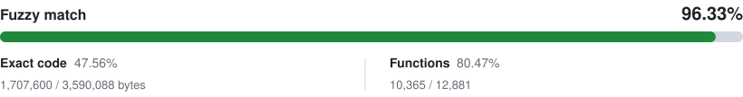

# Graffito Decomp

[](https://github.com/ryanbevins/Graffito-Decomp/actions/workflows/build.yml)
[](https://github.com/ryanbevins/Graffito-Decomp/actions/workflows/lint.yml)



Graffito Decomp is a work-in-progress, byte-matching decompilation of *Super Mario
Sunshine*. Its primary target is `GMSJ01` (Japanese Revision 0), using the
original Metrowerks CodeWarrior compiler for PowerPC/Gekko.

The project descends from [doldecomp/sms](https://github.com/doldecomp/sms) and
continues as a standalone research effort. The goal is readable C and C++ that
reproduces the original object code exactly wherever possible, with
instruction-level evidence for any code classified as functionally equivalent.

## Project status

- `GMSJ01`: active and supported.
- `GMSP01`: configuration retained, but currently incomplete and not a
  supported build target.
- The repository is under active development. APIs, names, layouts, and source
  organization may change as better evidence is recovered.

The current source tree does **not** contain game assets, retail binaries, or
generated assembly. You must provide your own legally obtained copy of the
game.

## Requirements

- Python 3
- [Ninja](https://ninja-build.org/)
- A legally obtained supported game disc image

On x86-64 Linux, the build downloads and uses
[wibo](https://github.com/decompals/wibo). Other Linux architectures require
Wine. macOS users can use
[wine-crossover](https://github.com/Gcenx/homebrew-wine). Native Windows tools
are recommended; WSL is not required and prevents objdiff from receiving
automatic filesystem notifications.

## Building

1. Clone the repository:

   ```sh
   git clone https://github.com/ryanbevins/Graffito-Decomp.git
   cd Graffito-Decomp
   ```

2. Copy your game disc image into `orig/GMSJ01/`.

   Supported input formats include ISO/GCM, RVZ, WIA, WBFS, CISO, NFS, GCZ,
   and TGC. After the initial extraction succeeds, the disc image can be
   removed from the project directory.

3. Configure and build:

   ```sh
   python configure.py
   ninja
   ```

Use `python configure.py --help` for version and toolchain overrides. To build
the current functionally equivalent source set rather than only byte-matching
objects, configure with `--non-matching` before running Ninja.

## Diffing

After the first successful build, `objdiff.json` is generated at the repository
root. Install [objdiff](https://github.com/encounter/objdiff), select this
repository as the project directory, and choose an object from the sidebar.
Source, header, configuration, split, and symbol changes rebuild automatically.


The command-line helper provides the same data in a form suitable for scripts:

```sh
python tools/decomp-diff.py -u mario/Enemy/bombhei
python tools/decomp-diff.py -u mario/Enemy/bombhei -d "TBombHei::perform"
```

See [tools/README.md](tools/README.md) for the other repository utilities.

## Repository layout

- `src/`: decompiled C and C++ implementation
- `include/`: declarations, inline functions, and reconstructed types
- `config/`: decomp-toolkit splits, symbols, hashes, and version configuration
- `tools/`: build, diff, audit, and investigation helpers
- `docs/`: reverse-engineering notes and the strict equivalence audit record
- `orig/`: local game inputs; ignored by Git
- `build/`: generated build outputs; ignored by Git

## Contributing

Contributions are welcome. Read [CONTRIBUTING.md](CONTRIBUTING.md) and
[AGENTS.md](AGENTS.md) before changing source. The project rejects fake
matching, behavior-changing codegen tricks, and unsupported equivalence claims.

## Lineage

Graffito Decomp was originally based on
[doldecomp/sms](https://github.com/doldecomp/sms). Upstream changes can be
reviewed by adding that repository as a remote:

```sh
git remote add upstream https://github.com/doldecomp/sms.git
git fetch upstream
```

Thank you to the doldecomp community and every contributor whose work made this
project possible.

## License and legal notice

Project-authored code and documentation are provided under the
[CC0 1.0 Universal dedication](LICENSE).

*Super Mario Sunshine*, Nintendo, GameCube, and related names and assets are
property of their respective owners. This is an unofficial research project
and is not affiliated with or endorsed by Nintendo.
